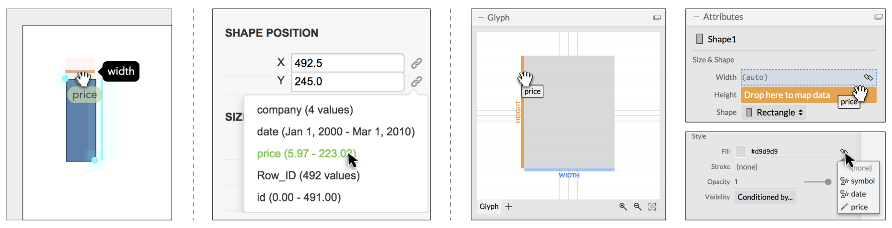

# Critical Reflections on Our System Components

We define <em>critical reflections</em> as informal discussions by system or
toolkit builders to concretely define their collective objectives in support
of the user community, and candidly assess the ways each system meets
or falls short of these objectives. In our case, all system builders met
weekly for 1 to 2 hour video conference meetings over the course
of 3 months. During these meetings we directly compared our three
systems: commenting on our design and implementation, reflecting on
practical feedback from the user community, and addressing missed or
unexplored research directions. To structure these conversations, we
began by considering the eight evaluative dimensions proposed by Ren
et al. [36]. We documented these discussions by recording meeting
notes in a shared online folder. At times, comparing the systems
required isolated, preliminary reflection on the individual authoring
systems which we documented in the shared folder. Each team carried
out these isolated reflections as “take-home” tasks before the next
weekly meeting. These isolated activities provided the due time to
exhaustively consider the ways in which each system met or fell short of
our defined objectives. Through this process, we collectively identified
<em>expressivity</em> and <em>learnability</em> as pervasive dimensions. Our process also
has the shared benefit of drawing on our collective experience to find
relevant consensus and build shared vocabulary.

## Marks

Instantiating <em>marks</em> is a fundamental operation in visualization authoring systems. A mark is a primitive graphical element in a visualization, which includes rectangle, symbol, line, arc, image, and other shapes.

In Lyra, an author may instantiate a mark by dragging the corresponding icon from the marks toolbar to the canvas. Data Illustrator uses a toolbar similar to vector graphics editing applications. An author instantiates a mark by activating the desired tool, and then draw on the canvas by mouse clicks and drags (depending on the system). Charticulator supports both approaches. While the drag-and-drop approach increases directness by requiring just one single action to create a mark, the system will need to provide a reasonable default location and size for the mark. When such choice is not valid, the author may see unexpected results. On the other hand, Data Illustrator's interaction introduces a state of the currently activated tool. When the author loses track of this state, s/he may unexpectedly create an unwanted mark. Charticulator relieves this problem by making the activated state one-off --- after creating the mark, the system deactivates the mark tool.

  

    <video src="videos/CreateMark-L.mp4"></video>
    <h4 class="name">Lyra</h4>
    
Create a rect by dragging

  

  

    <video src="videos/CreateMark-D.mp4"></video>
    <h4 class="name">Data Illustrator</h4>
    
Create a rect by drawing

  

  

    <video src="videos/CreateMark-C.mp4"></video>
    <h4 class="name">Charticulator</h4>
    
Create a rect by dragging

  

Authors sometimes need to create a <em>glyph</em> consisting of one or more marks. In Data Illustrator, this is done by drawing marks on the canvas and grouping them. Lyra similarly offers a "group" mark. Charticulator introduces a special canvas called the <em>glyph editor</em>, and marks can be instantiated in either the glyph editor or the chart canvas. Providing a separate glyph editor affords a larger editing region for a glyph, and makes it easier to select and manipulate marks. However, it introduces a deviation from conventional single canvas authoring systems. This design also requires the author to be aware that what is shown in the glyph editor is a prototype, and to predict the effect of an action on instances other than the currently selected one. Separating interactions between a glyph editor and a chart canvas also creates confusion, as the author will need to know the roles of the two canvases, and decide where to select and manipulate an object.

While Lyra and Charticulator rely on predefined mark types such as a rectangle, symbol, or text, Data Illustrator supports a wide spectrum of custom shapes by providing a "pen" tool --- a common feature in vector graphics software.
All shapes besides text and image are represented as paths. A path consists of multiple path points and path segments. An author can freely manipulate path points to achieve a desired shape. In addition, the location of path points and path segments can be bound to data. While this might be hard to learn for authors unfamiliar with vector graphics editing software, having such flexibility over mark shapes increases Data Illustrator's expressiveness.

In Lyra and Data Illustrator, marks include not only individual elements, but also polylines or curves that connect multiple data points. Lyra supports line and area marks. The (x, y) position for such marks can be bound to data to create lines or areas that connect through these points. In Data Illustrator, a line can be partitioned by a data column, resulting in a line with multiple path points. The (x, y) coordinates of such path points can be bound to data. In Charticulator, however, glyphs (which may contain multiple marks) are by design individual graphical elements. Each glyph corresponds to one or a group of data tuples. To create visual links <em>between</em> glyphs, authors need to use the "linking" tool, which draws lines or bands between glyphs. This separation of glyph and link introduces a level of indirectness that impacts learnability, as even basic line charts must use the link tool.

## Data Binding

Data binding is a core operation in authoring visualizations that involves (1) generating glyphs based on data, and (2) specifying a mapping between data fields and mark properties such as position, color, or size.

### What Data Does a Glyph Represent?

In Lyra and Charticulator, a glyph represents one data tuple, respectively. Authors thus need to prepare the dataset to fit this assumption. For example, to create a bar chart, each row in the dataset must correspond to one bar. Based on this assumption, the generation of glyphs is automatic in these two systems. Whenever a glyph is updated in the Glyph Editor in Charticulator, the system automatically generates glyphs, one per tuple; similarly, in Lyra, glyph generation by data is not a user operation. The underlying Vega grammar follows a <em>declarative</em> approach, and considers explicit glyph generation to be <em>imperative</em>. Glyphs are thus automatically generated by Vega when authors specify a mapping between a data variable and a visual property.

Data Illustrator relaxes the requirement of one-to-one glyph-tuple mapping, and allows a glyph to represent one or more tuples through two core operations: repeat and partition. Using the <em>Field Guide to Red and Blue America</em> dataset as an example (Section \ref{sec:scenario}), one can repeat or partition a rectangle using any of the categorical data variables. Repeating a rectangle by `State` will generate 51 rectangles (50 states and D.C.), and each rectangle represents all the tuples sharing the same `State` value. The tuples represented by each glyph are called the <em>data scope</em> of the glyph. The notion of data scope applies to path points and segments too. We can partition a line using `State`, and each point on the resultant path represent the corresponding tuples as its data scope.

Data Illustrator's approach allows authors to dynamically aggregate data in a more uniform fashion, and through direct manipulation, than the other two systems. For instance, a author can create a bar chart where each bar represents a `State` and the height encodes the average `PVI` values. To perform the same operation in Lyra, an author need to instantiate a "Group By" data transformation followed by a "Stats" calculation via the left-hand side configuration panels. Similarly, in Charticulator, authors need to specify a "Group By" attribute on the plot segment, which aggregates the data with user-selectable aggregators.

This improved expressivity, however, introduces an additional layer of complexity as authors must verify and keep track of the glyphs' data scopes. To address this issue, Lyra and Data Illustrator dynamically update the data table panel to reflect the data scope of selected marks.

These differences in glyph-tuple mapping have significant implications on authoring nested layouts, which we discuss in Section~\ref{sec:nested_layout}.

### Mapping Data Values to Visual Properties

Lyra offers two ways for constructing a data binding: data fields can be dragged to a property's inspector or to a property <em>drop zone</em>, a shaded region that overlays the visualization canvas. Data Illustrator eschews drag-and-drop interaction in favor of button-clicks. Properties that can be data-driven display a <em>binding icon</em> alongside their inspector; clicking the icon reveals a drop-down menu of data fields that the author can choose from. Charticulator adopts both approaches --- fields can be dragged to drop zones
or can be chosen from a drop-down menu revealed by clicking a property's binding icon. The figure below illustrates these different approaches.

<figure>

</figure>

  

    <video src="videos/HeightMapping-L.mp4"></video>
    <h4 class="name">Lyra</h4>
    
Bind PVIScore to height using drop zones; adjust the domain and range of the resulting scale

  

  

    <video src="videos/SetupLayout-D.mp4"></video>
    <h4 class="name">Data Illustrator</h4>
    
Bind PVI Score to the y position of the top line using dropdown menu; scale range is set by dragging the axis handle

  

  

    <video src="videos/HeightMapping-C.mp4"></video>
    <h4 class="name">Charticulator</h4>
    
Bind PVIScore to height using drop zones; scale range is automatically determined

  

  

    <video src="videos/ColorMapping-L.mp4"></video>
    <h4 class="name">Lyra</h4>
    
Create a "Indication" column with a formula, then bind the Indication column to fill color and adjust the color scale

  

  

    <video src="videos/ColorMapping-D.mp4"></video>
    <h4 class="name">Data Illustrator</h4>
    
Bind the <b>pre-computed</b> Indication column to fill color and adjust the color scale

  

  

    <video src="videos/ColorMapping-C.mp4"></video>
    <h4 class="name">Charticulator</h4>
    
Bind the <b>pre-computed</b> Indication column to fill color and adjust the color scale

  

The differences in these data binding interactions are grounded in learnability. Lyra's design sought to be familiar to Tableau users, while also increasing their sense of directness. Thus, dropping fields to property inspectors recalls Tableau's "shelves" metaphor~\cite{Stolte2002Polaris} while adding additional drop zones to the visualization canvas. Overlaying drop zones directly over the properties they correspond to narrows the gulf of execution~\cite{norman:doet}. A first-use study confirmed these effects as participants described drop zones as <em>"natural"</em> and <em>"intuitive"</em> and, when compared to Tableau's shelves, made them feel more in control. However, participants also identified two weaknesses in this interaction model: (1) drop zones provide a small active region that can be difficult to hit consistently; and (2) drop zones rely on a having a mark selected, which determines how drop zones are depicted, and can be difficult to keep track of after a data binding occurs.

Data Illustrator was intentionally designed to address these shortcomings, and identified two additional concerns. Tableau and Lyra ask authors to perform dragging operations over potentially long distances, which yields a poor experience in terms of both efficiency and accessibility (e.g., for users with motor impairments). Moreover, neither system makes it clear if particular data bindings would result in inexpressive or ineffective outcomes~\cite{mackinlay1986automating} (e.g., binding a quantitative field to an identity channel such as shape~\cite{munzner2014visualization}). Data Illustrator's binding icon, in comparison, provides a single interface element that is consistently displayed regardless of the particular property being targeted. Clicking the icon, and selecting a field from the drop-down menu, is more efficient than performing a drag operation, and available fields are filtered to ensure only valid data bindings can be constructed. These gains, however, are offset by a loss of directness --- data binding is the only core operation in Data Illustrator that cannot be specified by manipulating the visualization itself.

Charticulator makes the fewest compromises by adopting both the binding icon and drop zone model, and refining the latter in a few crucial ways. When one begins to drag a field, only valid drop zones are shown (and corresponding property inspectors highlighted) to ensure that improper data bindings cannot be constructed. And, the drop zones are visualized in the glyph editor, providing a single consistent place in the interface for interacting with them rather than Lyra's dependence on the currently selected mark instance. As a result, Charticulator is able to maintain Data Illustrator's efficiency and accessibility advantages, without sacrificing Lyra's directness. Echoing Lyra's evaluation, participants in Charticulator's usability study rated drag-and-drop interaction as one of the aspects they liked most about the system.

However, there are still opportunities for further improvement. Charticulator's drop zones, like Lyra's, provide a relatively small active region and thus require the author to perform a fairly precise interaction. This design can yield a frustrating experience when a author drops a field close to, but not directly over, a drop zone. Inspired by the bubble cursor~\cite{grossman2005bubble}, an in-development version of Lyra accelerates drop zone acquisition by computing an invisible Voronoi tesselation over valid drop regions. Thus, the drop zone nearest to the mouse cursor is automatically chosen and the author no longer needs to drop directly over a drop zone to successfully establish a data binding.

In all three systems, the outcome of establishing a data binding is immediately reflected on the visualization canvas. This behavior tightens the feedback loop, enabling a more iterative authoring process and reducing the gulf of evaluation~\cite{norman:doet}. Lyra and Data Illustrator, however, identify a further need to bridge this gulf. They note that interactive data binding results in an accretive authoring process that displays intermediate visualization states to the author. For instance, in Lyra, binding a rectangle's height before its x-position or width produces a set of overlapping mark instances. In Data Illustrator, a mark's <em>data scope</em> (i.e., the set of tuples it is bound to) may change over time. Both systems scaffold this experience by exposing the backing data in a persistent tabular interface (Charticulator's data table is a modal display). Data Illustrator goes a step further by only displaying records in the table that correspond to the selected mark's data scope.

Although our discussion here has centered on how these data binding interactions are designed to support learnability, there are important expressivity concerns as well. For instance, Lyra's two data binding mechanisms carry different semantics. When a data field is dragged to a drop zone, the system automatically infers the necessary scale functions and adds appropriate axes or legends to the visualization. This inference does not occur if the field is dropped over a property inspector, allowing for more fine-grained design choices (e.g., if the author wishes to use a scale function they have manually constructed, as described in~\ref{sec:scales}) or for authors to bypass scale functions and have visual properties set to data values directly (e.g., when colors carry semantic resonance, as is typical with public transit data, or if data values are produced by algorithmic layouts, see~\ref{sec:layout}). However, Lyra does not provide clear affordances communicating these differences in its interface. When an author releases a field over a property inspector, they may notice that the corresponding interface element for a scale function does not appear, but this difference is subtle and requires them to have a sufficient level of expertise to understand the purpose of scales. One could refine this design for learnability, without sacrificing the expressivity gains, by making it opt-in: by default, dropping fields on property inspectors could still trigger scale inference, but a dialog box could allow more advanced authors to bypass it for future interactions.

Data Illustrator's data binding also carries subtly different semantics compared to the other two systems. If a data binding is removed, marks do not revert back to their previous, unbound appearance (as they do in Charticulator and Lyra). Instead, they return to being standard vector shapes that can be manipulated via drawing interactions like dragging to resize, rotate, or move. This strategy, called a <em>lazy</em> data binding, enables "fuzzy" layouts that approximate the original data values and supports an approach that researchers have found occurs commonly in practice, as designers seek to maintain a flexible and rich design process~\cite{Bigelow2014DesignWithData}. While powerful, it is also important to note that this technique is ripe for misuse, making it easier for people to author visualizations that look roughly accurate but with subtle changes introduced. Although it would be impossible for a system to entirely prevent such misleading visualization from being created, there are a number of ways that these outcomes could be mitigated. For instance, the system could warn authors and ask them to confirm their desire to remove a data binding. Marks that are subsequently manipulated could be identified with a persistent warning in their configuration panel, with an option to revert any changes. Or, the output visualization could allow readers to re-establish data bindings and compare the differences for themselves (e.g., via an overlay display or through animation).

## Scales, Axes, & Legends

Our systems all use three constructs to operationalize data bindings: (1) scales, functions that map the data domain to a range of visual values; (2) axes, visualizations of spatial scales; and, (3) legends, visualizations of scales of non-spatial properties such as color, shape, or size. However, how visible these abstractions are to authors, and how the constituent properties are manipulated, vary significant as the three systems make different tradeoffs between expressivity and learnability.

### Scale Visibility

\figureScalesAxesLegends

When a data binding interaction is performed, all three systems automatically construct any necessary scale functions. However, they lie along a spectrum with regards to the degree these scales are exposed to the author. At one end lies Lyra, which provides scales as first-class primitives: authors are able to manually construct a scale independent of any data binding interaction. At the other end sits Charticulator, which does not distinguish a scale from its axis or legend --- controls to modify the domain or range are shown on axis or legend configuration panels. And, Data Illustrator lies in-between. When an author clicks the bind icon they are prompted to create a new scale, or reuse an existing scale if the field has been previously used. Similarly, via the same interface, authors can elect to instead merge scales, producing a single scale with a domain unioned across several fields.

The level of visibility has clear implications for expressivity. For example, in Data Illustrator, merging the scale functions enables authoring Gantt Charts where task start and end times are recorded as separate fields. Authors using Lyra have complete control over scale functions. Thus, they can create a scale with a domain that spans multiple distinct data fields, subsequently use it with a field outside of its domain to determine a data binding, and reuse or merge scales in a more fine-grained fashion than in Data Illustrator. This flexibility can be important even for creating simple visualizations. For instance, consider a scatterplot in which the author wants to ensure Euclidean distances are accurately plotted, or an asymmetric adjacency matrix. Both these examples require using a single scale function for both the x and y dimensions, with a domain unioned over two data fields.

However, this expressivity comes with a non-trivial complexity cost. Once an author establishes a data binding, Data Illustrator's interface does not make clear which scale function is being used --- is it a new scale, is it an existing scale, or have scales been merged? Though HCI theory cites maintaining high visibility into system components as an important dimension for reducing the gulf of evaluation~\cite{hutchins:direct, blackwell2003notational}, on-going feedback for Data Illustrator and Lyra indicate that authors struggle to understand the role that scales. In Lyra, this issue is compounded by the additional user interface elements that come with first-class scales: a separate panel that lists all available scale functions; and, a corresponding interface element for each scale that can be dragged and dropped, and appears alongside data fields as part of a data binding. Ironically, behavior that was designed to reduce interface clutter --- scales, axes, and legends that were automatically created are also automatically removed when they no longer participate in a data binding --- has had the knock-on effect of increasing churn in the user interface. How best to address this complexity, without losing the expressivity gains, remains unclear. An "advanced" mode is unappealing, as it introduces additional discovery costs, and would turn this complexity into a cliff rather than smoothing it out. We explore an alternate strategy Lyra might take in the subsequent subsection.

### Manipulating Axes & Legends

Data Illustrator and Charticulator couple a scale to its axis or legend representation. Modifications of axis or legend properties (e.g., specifying an alternate color palette) map to transformations of the underlying scale function. Lyra, on the other hand, provides axes and legends as first-class primitives that can be modified independently from the corresponding scale. Lyra's approach yields expressive gains as well as a less viscous user experience~\cite{blackwell2003notational} --- for instance, axes and legends can be created to visualize scales that do not participate in a data binding, and alternate scales can be chosen without losing any axis or legend customizations. Nevertheless, to address the complexity of scale visibility, Lyra may consider adopting a hybrid approach: scales, axes, and legends remain first-class primitives that can be manually constructed and independently customized, but are coupled if they are created automatically during a data bind.

As Figure~\ref{sec:scales} shows, authors customize axes and legends via configuration panels in Lyra and Charticulator while Data Illustrator opts for a more direct interaction model: authors can click and drag to reposition axes and legends; handles overlay axes on hover and can be dragged to shorten or lengthen an axis; and clicking individual entries in a color legend launches a color picker. Data Illustrator's interaction model significantly reduces the articulatory distance of modifying scale functions but also introduces concerns of hidden dependencies~\cite{blackwell2003notational}. As axes and legends provide the sole mechanism for reifying scale functions, if they can be freely repositioned on the canvas, it can be easy to lose track of which marks they correspond to. More problematically, support direct manipulation modification has slowed down progress on expanding expressivity. Although Data Illustrator's underlying framework is capable of expressing axis and legend customizations (e.g., to grid lines, ticks, labels, etc.), how to expose this functionality via direct manipulation remains ongoing work. Lyra's configuration panels, though they afford less of a sense of directness, provide an extensible interface component that surfaces these fine-grained properties in a consistent fashion.

Charticulator makes an important exception to its treatment of axes and legends: legends, unlike axes, are not automatically added to the visualization. Instead, authors must manually add a legend using a predefined legend element or by creating a new glyph in a separate plot element. Although authors could choose to manually create custom legends in Lyra or Data Illustrator, Charticulator makes this choice more explicit. This approach is designed to recognize that while axes have a mostly uniform appearance (a main horizontal or vertical line, with individual tick lines, labels, and a title), legends have a much more expressive design space. For instance, a designer may choose to directly label a multi-series line chart rather than use a separate legend. By not automatically adding a legend, Charticulator seeks to reduce an author's propensity for design fixation~\cite{jansson1991design}, but it incurs a non-trivial learnability cost. The button to add a pre-defined element is buried within a configuration panel (see Fig.~\ref{fig:ScalesAxesLegends}), and creating a high-fidelity legend can be as complex as authoring the original visualization. Future versions might lower this threshold~\cite{myers:past} through new abstractions for generating legend entries (e.g., akin to Data Illustrator's repeat).

## Layout

To enable expressive layout, the systems expose a variety of methods for manual and relative positioning along a coordinate system, as well as collective placement for nested and small multiples displays.

### Relative Layout

Both Lyra and Charticulator use an <em>anchor</em> for relative positioning between visual objects. In Lyra, once authors establish a connection by dragging a target mark onto a host mark's anchor, the target mark’s position is automatically determined by the host's properties. Similarly, Charticulator uses anchors and handles to specify the layout relationship between two objects in both the glyph level (i.e., between marks) and in the chart level (i.e., between plot segments and one-off marks). Moreover, Charticulator's marks have margin and alignment properties that can be used for similar means. For example, a text mark representing a data value for each bar can be placed at the bottom of the bar (inside or outside) or at the top of the bar (with the same distance from the bar). Snapping one mark to another results in a snapping constraint, which remains in effect unless the author proactively unsnaps the mark. These behaviors are not found in vector graphics environments. Despite a learnability cost, these constraints specify more reusable designs.

### Layout in a Collection

After generating shapes from data (Section \ref{sec:mark-tuple-mapping}), we get a collection of marks/glyphs. In Lyra, these glyphs are placed at the same position, overlapping each other, since they are duplicates of the original glyph prototype. Doing so, however, would not reveal that multiple glyphs have been created and this could confuse people. To address this problem, Charticulator introduces a scaffold to position the glyphs in simple (horizontal or vertical) stacking, grid, and circle packing layouts. Data Illustrator adopts a similar approach. Marks generated by the repeat operation are placed in a grid layout by default, whereas marks generated by the partition operation are stacked by default. The interface allows one to adjust the horizontal and vertical gaps in a grid layout by directly manipulating padding handles. These design choices allow automatic positioning of glyphs in a collection without any specification of mappings between data variables and spatial coordinates. Once an author binds a data variable to the x- and y- positions of marks, an axis is generated and the glyphs are placed based on data values.

  

    <video src="videos/SetupLayout-L.mp4"></video>
    <h4 class="name">Lyra</h4>
    
Group by MapX and MapY (see note below), then bind Year to X start

    
<small>Note: a bug in Lyra prevents the ideal interaction for group layout described in the paper. We demonstrate an alternate workaround instead.</small>

  

  

    <video src="videos/SetupLayout-D.mp4"></video>
    <h4 class="name">Charticulator</h4>
    
Partition and repeat the rect, then bind MapX and MapY to X and Y

  

  

    <video src="videos/SetupLayout-C.mp4"></video>
    <h4 class="name">Charticulator</h4>
    
Bind MapX and MapY to the X, Y axes of the plot segment, then switch to "Stack X" sublayout

  

### Nested Layout

Nested visualizations such as grouped bar charts and small multiples are common. As mentioned in Section \ref{sec:mark-tuple-mapping},
the differences between the systems in terms of mark generation and data mapping have ramifications on the creation of nested structures. In Charticulator, once a rectangle is added in the glyph editor, the system automatically generates all the marks, one mark per tuple. The main task is thus to lay out these marks. The basic layout in the <em>Field Guide to Red and Blue America</em> example (Fig.~\ref{fig:RedBlueAmerica}) is specified in three steps in Charticulator: bind `GridX` to the plot segment's x-axis, bind `GridY` to its y-axis, and apply "Stack-X" sub-layout (Fig.~\ref{fig:RedBlueAmericaSteps}). When binding a variable to an axis, Charticulator makes automated decisions: if the variable is categorical, and if multiple marks share the same value, Charticulator will group these marks and apply a default grid sub-layout to arrange them; if the variable is numerical, no grouping will be applied, and the marks will be at the same position, on top of each other. This automated decision requires `GridX` and `GridY` to be formatted as strings (e.g., "I5") instead of numbers (e.g., 5). Authors unaware of this logic may have difficulties in understanding system behavior.

Nested layout in Data Illustrator is achieved by combining repeat and partition operations. Figure \ref{fig:RedBlueAmericaSteps} shows one workflow: partition a rectangle by `Year`, which results in a collection of rectangles; then repeat the collection by `State`. Alternatively, we can repeat a rectangle by `Year`, and then repeat the resultant collection by `State`. The combination of repeat and partition operations is flexible, and requires authors to have a good understanding of how these two operations work.

In Lyra, nested layouts are achieved via "group" marks that are automatically instantiated when authors drag data fields to the "Grouped Horizontally" or "Grouped Vertically" drop zones, or instantiate a "Group By" data transformation. These marks, akin to Charticulator's plot segments,  serve as containers for axes, legends, and graphical marks. Thus, to recreate our example, we first add a "Group By" data transform and drop `State` into its property inspector. We then drag `GridX` and `GridY` to the resultant group mark's "width" and height drop zones, respectively, which both positions and sizes the groups. Like Charticulator, Lyra expects `GridX` and `GridY` to be strings to infer a categorical scale for group positioning. Lyra's approach is the weakest of the three systems, as it introduces a set of hidden dependencies that present a highly viscous experience~\cite{blackwell2003notational}. A priori it is not at all clear that group marks exist, and if one wishes to switch between horizontal and vertical layouts, they must remove and recreate the grouping.

These different ways of representing and constructing nested layout have implications on component selection. As Lyra maps interactions to declarative statements in the Vega visualization grammar, which does not formally represent graphical components such as collections, there are fewer types of selectable components. In Data Illustrator, the selection mechanism is hierarchical: Clicking once selects the top level collection, double clicking opens up the collection so that the individual marks can be selected. This design closely follows the selection model in Adobe XD. Selecting a mark can be tedious, however, if authors intend to select a mark embedded in multi-level nested collections, multiple double clicks are needed to open up the collections hierarchically. To avoid this problem and reduce visual clutter, Charticulator provides two separate editing canvases: a glyph editor, and a chart canvas. The selection of marks and anchor points can take place in either the glyph editor or the chart canvas. Selecting a glyph or a plot segment solely happens in the chart canvas.

For more complicated visualizations such as small multiples with multiple levels of nesting, Data Illustrator keeps a consistent user interface, allowing people to apply the repeat operation multiple times. Similarly, Lyra's group marks can be nested arbitrarily deep, by instantiating additional "Group By" transforms, or using the corresponding drop zones. Charticulator, on the other hand, extends the notion of a glyph to include a "nested chart." To create a nested chart, one can either import a pre-exported Charticulator template, or use the "nested chart editor," which is essentially a popped-up Charticulator user interface with the nested chart and its corresponding portion of the dataset. Authors can then generate glyphs with "nested charts" by data. There are some limitations of this approach, however. Each small multiple instance has its own constraint solver, thus it's not possible to add constraints across the instances. In addition, scale and axis parameters are currently shared across instances of small multiples, but they are inferred from a single small multiple instance. The author has to manually unify scales/axes across all instances.

### Coordinate Systems

The Cartesian coordinate system is a fundamental aspect of chart layouts. As such, Lyra, Data Illustrator, and Charticulator all support the Cartesian coordinate system. However, each takes a different approach to address additional coordinate systems or more advanced layouts including algorithmic ones.

Lyra's grammatical primitives only offer compositional expressivity for the basic Cartesian coordinate system and its "reactive geometry"~\cite{satyanarayan2016reactive} makes it possible to anchor marks together for additional layouts (e.g., stacking, pie charts). Lyra supports more advanced layouts (e.g., treemaps) using modules that can be invoked from button presses/property inspectors, often requiring a specific data format (e.g., geographic, hierarchical, network data); people need to choose from a typology of data transformations.
In other words, Lyra's different specification options result in an inconsistent interaction model.

In contrast, Data Illustrator's repeat and partition operators offer a consistent mechanism for basic and advanced layouts, but important implementation and conceptual limitations remain. Support for polar coordinates is conceptually well-defined though it has yet to be implemented. For instance, partitioning a circle would produce a pie chart.
However, how these operators extend to support geographic, hierarchical, or network data is an open question.

Charticulator's system of constraints offers the most uniform underlying model for layout, enabling coordinate systems such as polar and arbitrary curve coordinates, in addition to Cartesian. Advanced layouts can be implemented as a module and incorporated into Charticulator via an additional panel (as Lyra did). However, because this is not aligned with one of the core design goals (i.e., enabling people to specify a novel layout using a set of partial constraints), we acknowledge these additional algorithmic layouts as a known limitation.

  

    <video src="videos/CreateText-L.mp4"></video>
    <h4 class="name">Lyra</h4>
    
Add a text mark, bind state name to text, and MapY to the Y position

  

  

    <video src="videos/CreateText-D.mp4"></video>
    <h4 class="name">Data Illustrator</h4>
    
Add a text mark to the top of the rectangle, bind state name to text, then use conditional visibility to show text for the first year only

  

  

    <video src="videos/CreateText-C.mp4"></video>
    <h4 class="name">Charticulator</h4>
    
Add a text mark to the top of the rectangle, bind state name to text, then use conditional visibility to show text for the first year only

  

